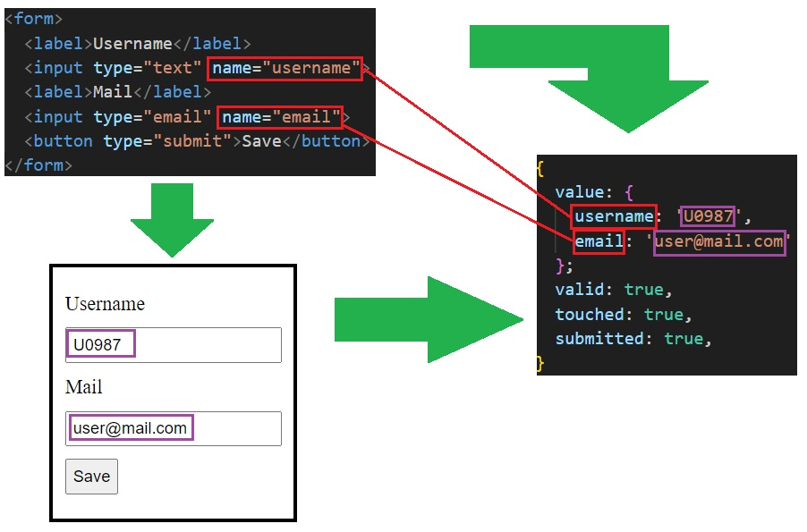

# Before Start

In order to work with Angular you'll need:

1. Check if you have NodeJs installed on your pc (in prompt command use `node --version`)
2. If you don't have it, you can download and install it from [NodeJs](https://nodejs.org/en/download/)
3. Install Angular running in a terminal the command `npm install -g @angular/cli.`
4. Install any IDE, like for example [VisualStudio](https://visualstudio.microsoft.com/downloads/)
5. To work easier with Angular projects using Visual Studio, it is recommended to install the plugin called `Angular Essentials`

# Start a Project

1. to create a new project called `myProject` run `ng new myProject`
2. if you want to use an old project, you have to go into the root folder and run `npm install` to install all the package listed inside the `package.json` file

Index:

1. [Run the application](#run-the-application)
2. [Default Angular files and folders](#default-angular-files-and-folders)
3. [Components](#components)
4. [Data binding](#databinding)
5. [Directives](#directives)
6. [Services](#services)
7. [Routing](#routing)
8. [Forms](#forms)
9. [Pipes](#pipes)

## Run the application

Run `ng serve` to run the application. Navigate to `http://localhost:4200/`. The application will automatically reload if you change and save any of the source files.

## Default Angular files and folders

Inside the project directory you can find the files and directories that an Angular app needs to build and run, but they are not files that you normally interact with:

1. `.angular` has files required to build the Angular app.
2. `.e2e` has files used to test the app.
3. `node_modules` folder (if not, run `npm build`) that has the node.js packages that the app uses.
4. `angular.json` describes the Angular app to the app building tools.
5. `package.json` is used by npm (the node package manager) to run the finished app.
6. `tsconfig.*` are the files that describe the app's configuration to the TypeScript compiler.

Let's move to folder where we'll work more, the `src` folder:

1. `index.html` is the app's top level HTML template.
2. `style.css` is the app's top level style sheet.
3. `main.ts` is where the app start running.
4. `favicon.ico` is the app's icon, just as you would find in any web site.
5. `app` folder where new components willbe added later:
   - `app.component.ts` is the source file that describes the app-root component. This is the top-level Angular component in the app. A component is the basic building block of an Angular application. The component description includes the component's code, HTML template, and styles, which can be described in this file, or in separate files. In this app, the styles are in a separate file while the component's code and HTML template are in this file.
   - `app.component.css` is the style sheet for this component.
6. `assets` folder contains images used by the app

## Components

New component can be generated automatically or manually.
To create automatically a component called `servers`, run:
`ng generate component servers`
or the short command
`ng g c servers`
It will generate 4 files in a new folder `./server`:

1. `servers.component.ts` (containing the logic)
2. `servers.component.html` (containing the template HTML)
3. `servers.component.css` (containing the style CSS)
4. `servers.component.spec.ts` (file to test the ts logic)
   and update `app.module.ts`:
   you should add in declaration the new component class
   `declarations: [AppComponent, ServersComponent],`
   in order to be able to use in `app.component.html` the `<app-servers></app-servers>` component.

If you are still not interested in testing, you can skip the creation of the `spec.ts` file, adding `--skip-tests true` at the end of you command line:
`ng g c servers --skip-tests true`

More details can be found in [component.md](./src/documentation/component.md)

## Databinding

`Data binding` is an Angular is the synchronization between the model and the view.
It creates a communication between the `business logic` (servers.component.ts) and the `template` (servers.component.html)


More details can be found in [data-binding.md](./src/documentation/data-binding.md)

## Directives

`Directives` are classes that add behavior to the elements.

There are two main categories:

1. `attribute directives` (e.g. `ngClass`, `ngStyle`, `ngModel`) modify the behavior or the appareance of an element, changing e.g. style
2. `structural directives` (e.g. `*ngIf`, `ng-template`, `*ngFor`, `ngSwitch`, `*ngSwitchCase`) change the DOM adding/removing elements.
   **Please note:** you CANNOT had two structural directives in the same element.

You can use the build-in directives or you can build your own.

More details can be found in [directives.md](./src/documentation/directives.md)

## Services

New `service` can be generated automatically or manually.
To create automatically a service called `global`, run:
`ng generate service global`
or the short command
`ng g s global`
It will generate 2 files in the current folder:

1. `global.service.ts` (containing the logic)
2. `global.service.spec.ts` (file to test the ts logic)

If you are still not interested in testing, you can skip the creation of the `spec.ts` file, adding `--skip-tests true` at the end of you command line:
`ng g c global --skip-tests true`

More details can be found in [services.md](./src/documentation/services.md)

## Routing

In the old application, you need to have several HTML template files, one for each page you display, and every time you change pages, you have to load the new one.

Angular allows to create web applications that use data and can change over time without reloading the page. It primarily aims to provide speed, simplicity, and scalability.

Instead of different HTML templates, Angular uses different views, the above mentioned [`component`](#components), that are included in the `root component` inside the `index.html`. In this way you load only once only one file (`index.html`) and you manage the views using `directives` and `services`.

As users perform application tasks, they need to move between the different views that you have defined. To handle the navigation from one view to the next, you use the `Angular Router`. \
The Router enables navigation by interpreting a browser URL as an instruction to change the view.
The `routing` create a virtual URL, so users can change page and URL without reloading the page, as they are always on the same page, but different views are displayed.

More details can be found in [routing.md](./src/documentation/routing.md) or on Angular documentation about [routing](https://angular.io/guide/routing-overview)

## Forms

Angular helps you to transform HTML forms into TypeScript object you can use to manipulate forms data.



Using Angular, you can obtain, from the `HTML form`, an object containing

1. the `value` of the form in pair of control name/value
2. the `status` of the form in boolean properties like e.g. valid, touched or submitted.

There are two ways of handling forms in Angular:

1. Template Driven (TD) form
2. Reative form

In the first case you handle the form mostly in the HTML template (useful for easy case)

In the second case you handle the form with use of TypeScript. (suggested for more complicated operation related with the form).

More details can be found in [forms.md](./src/documentation/forms.md) or on Angular documentation about [Angular forms](https://angular.dev/guide/forms)

## Pipes

`Pipes` are simple functions to use in HTML template expressions to accept an input value and return a transformed value, e.g. `uppercase`, to change in uppercase a string.

`Pipes` are useful because you can use them throughout your application, while only declaring each pipe once.

You can create your own custom pipes, or apply multiple pipes.

You apply pipes when you use the string interpolation, just adding the `pipe` method after a pipe `|`:

```
{{'world | uppercase}}
```

will display `WORLD`

More details can be found in [pipes.md](./src/documentation/pipes.md) or on Angular documentation about [Angular pipes](https://angular.dev/guide/pipes)
