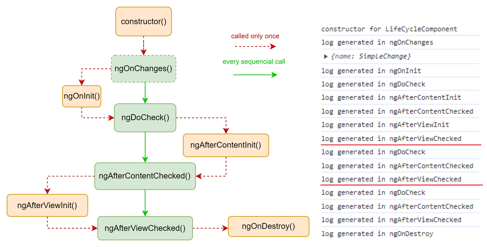
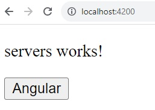

# Component life

You have created a new component that implement all the hooks of the component life:

```
@Component({
  selector: 'app-life-cycle',
  templateUrl: './life-cycle.component.html',
  styleUrls: ['./life-cycle.component.css'],
})
export class LifeCycleComponent
  implements
    OnInit, OnDestroy,
    DoCheck, AfterContentInit,
    AfterContentChecked, AfterViewInit,
    AfterViewChecked, OnChanges
{
  @Output() boolEvent = new EventEmitter();
  @Input() name: string = '';
  ...
}
```

You have a log in the console every time the hook is implemented.
(e.g. _"log generated in ngOninit"_)

In your implementation you have used the _@Input()_ decorator to get a value from the parent (the label of the button), and _@Output()_ decorator to send a value to the parent (to disable the entire component). \
Let's analyze the follow picture that shows on the left the life cycle, and on the right an extract from the dev tool of Chrome while running the app.


<!---->

As soon as the application starts:

1. The component is created (_the object/class_) using the `constructor()`.
2. The parameters values are loaded, if needed, in your case the _@Input()_ is actually the trigger for this loading as it gets the value from the parent component.
3. Only if any loading happens, the parameters values change, and the `ngOnChanges()` is called
4. The element can now be initialized with `ngOnInit()`
5. The `ngDoCheck()` is called to check the component
6. The `ngAfterContentInit()` as the name said is called after the content (`ng-content`) of the component has been initialized and projected to into view.
7. The `ngAfterContentChecked()` check the component after content is ready.
8. The `ngAfterViewInit()` as the name said is called after the view of the component (and `child views`) have been initialized.
9. The `ngAfterViewChecked()` check the component after view (and `child views`) are ready.

You have now reached the end of the first loop.



Application will run another small loop with:

1. `ngDoCheck()`
2. `ngAfterContentChecked()`
3. `ngAfterViewChecked()`

to double check all the previous 9 hooks.

If you press the button named _Angular_, it will delete (destroy) the component so we'll have:

1. `ngDoCheck()`
2. `ngAfterContentChecked()`
3. `ngAfterViewChecked()`
4. `ngOnDestroy()`

They are the three common hooks, plus the `ngOnDestroy()` as the component has been destroyed and does not exist anymore.
