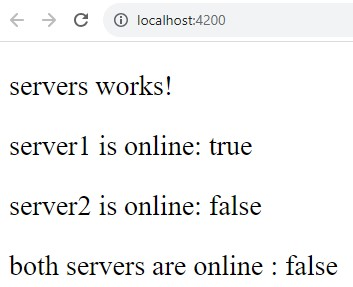
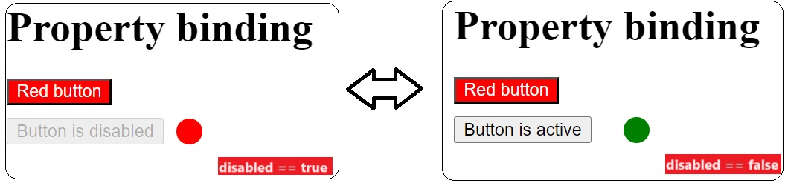
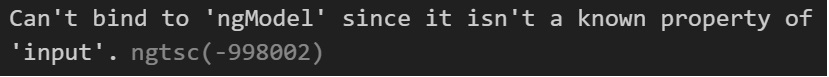

# Data binding

`Data binding` creates a communication between the `business logic` (servers.component.ts) and the `template` (servers.component.html)

To send data, from the business logic to the user interface, you can use two type of databinding:

- [`string interpolation`](#string-interpolation)

- [`property binding`](#property-binding)

To send data, from the user interface to the business logic, you can use:

- [`event binding`](#event-binding)

To send data in both side at the same time, you can use:

- [`two-way-binding`](#two-way-binding).

---


## String Interpolation

To understand the possible uses of the `string interpolation`, let's see an example:

`servers.component.ts`

```
  servers = [new Server('server1', true), new Server('server2', false)];

  getServerStatus(serverName: string): boolean {
    return this.servers.filter((server) => server.name === serverName)[0]
      .online;
  }
```

The variable `servers` is an Array of `Server` objects defined in:

`server.model.ts`

```
export class Server {
  constructor(public name: string, public online: boolean) {}
}
```

The method `getServerStatus()` returns the server status from the server name.

Now you can use the `string interpolation` to display data in:

`servers.component.html`

```
<p>servers works!</p>
<p>{{servers[0].name}} is online: {{servers[0].online}}</p>
<p>{{'server2'}} is online: {{getServerStatus('server2')}}</p>
<p>both servers are online : {{servers[0].online && servers[1].online}}</p>
```

on the screen you'll see:


From the example above you can see that `string interpolation` has the syntax `{{data}}` where `data` could be:

1. **any string** (e.g. _'server2'_)
2. **any variable** defined in `servers.component.ts` (e.g. _servers[0].online_ or _servers[0].name_)
3. **any method** defined in `servers.component.ts` (e.g. _getServerStatus('server2')_)
4. **any typeScript code** (e.g. _servers[0].online && servers[1].online_)

## Property Binding

Using `property binding` you can make dynamic any property.

In the example we have:

`property-binding.component.html`

```
<h1>Property binding</h1>
<button [style.background-color]="'red'" [style.color]="getTextColor()">Red button</button>
<div class="flex-container">
  <button [disabled]="disabled">Button is {{disabled?'disabled':'active'}}</button>
  <p [style.background-color]="disabled?'red':'green'" class="circle"></p>
</div>
```

`property-binding.component.ts`

```
  disabled = true;
  constructor() {
    setInterval(() => {
      this.disabled = !this.disabled;
    }, 2000);
  }
  getTextColor() {
    return 'white';
  }
```

`property-binding.component.css`

```
.circle {
  height: 20px;
  width: 20px;
  border-radius: 50%;
}

.flex-container {
  display: flex;
  flex-direction: row;
  width: 150px;
  justify-content: space-between;
  max-height: 20px;
  align-items: center;
  margin: 10px 0px;
}
```

This implementation will change every 2 seconds the value of the boolean `disabled` in `property-binding.component.ts`.

The customer will see, based on the value of `disabled` the following view:


From the example above you can see that `property binding` has the syntax `[property]="data"` where `data` could be:

1. **any string** (e.g. _'red'_)
2. **any variable** defined in `property-binding.component.ts` (e.g. _disabled_)
3. **any method** defined in `property-binding.component.ts` (e.g. _getTextColor()_)
4. **any typeScript code** (e.g. _disabled?'red':'green'_)

## Event Binding

The `event binding` is similar to the events in JS, where you can use both build-in events or customized events.

There is a small difference on how you call the event in Angular comparing with JS, `Angular events` do not start with 'on' but replaces it adding parenteses before and after the event name.

```
JS event      => onclick = "expression"
Angular event => (click) = "expression"
```

Let's see an example:

`event-binding.component.html`

```
<h1>Event binding</h1>
<label for="name">Name</label>
<input (input)="onInput($event)" type="text" name="name" [value]="defaultValue">
<button (click)="onClick()">Reset</button>
<button (click)="color='red'">Change text color to red</button>
<p [style.color]="color">Hello {{userName}}</p>
```

`event-binding.component.ts`

```
userName = 'unknown user';
  defaultValue = '';
  color = 'black';

onClick() {
  this.defaultValue = '';
  this.userName = 'unknown user';
}

onInput(event: any) {
  this.userName = event.target.value;
  this.defaultValue = this.userName;
}
```

`onInput()` method can be more specific in the argument type definition, so you can define event of type `Event`, but later you need to cast `event.target` to a `HTMLInputElement` in order to allow Angular understanding the `.value` command.

```
onInput(event: Event) {
  this.userName = (<HTMLInputElement>event.target).value;
  this.defaultValue = this.userName;
}
```

In the above example we have an `input field`, a `reset button`, a `change color button` and a `paragraph`. \
Every time you update the value in the `input field`, the paragraph will say hi to that username. The `reset button` will reset the username to the default value, and the `change color button` will change the text color of the greating message.

The `event binding` has the syntax `(event) = "expression"` where event can be:

1. any method defined in `event-binding.component.ts`(e.g. _onClick()_ or _onInput($event)_)
2. any typeScript code (_(click)="color='red'"_)

**Please note** that you can pass the event itself in the method that will be invoked by the event (_onInput($event)_) using the `$event`.

## Two-Way-Binding

The `two-way-binding` allows to udpate a property from both sides:

- `user side` (_via events triggered by the user_)
- `business logic side` (_via methods written in typescript_).

Let's see an example:
`two-way-binding.component.ts`

```
username = '';

onReset() {
  this.username = '';
}
```

`two-way-binding.component.html`

```
<h1>Two Way Binding</h1>
<label for="name">Name</label>
<input type="text" name="name" [(ngModel)]="username">
<button (click)="onReset()">Reset</button>
<p>Hello {{username!=''?username:'unknown user'}}</p>
```

**Please note** that you can get the following error trying using `ngModel`:



To fix it, you must add in the `app.module.ts`:

1. the `FormsModule` to the `import[]` array
2. the import for `FormsModule` from `@angular/forms`:
   ```
   import { FormsModule } from '@angular/forms';
   ```

The `two way binding` acts as a combination of `event binding` and `property binding`, in fact, its syntax is also a combination of their syntax:\
`[(ngModel)] = data` where `data` is a variable defined in `property-binding.component.ts` (e.g. _username_).
