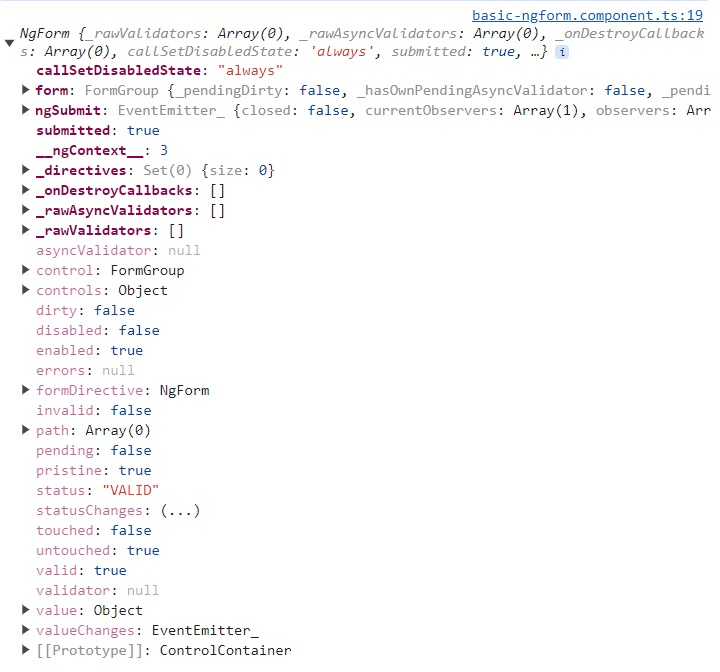
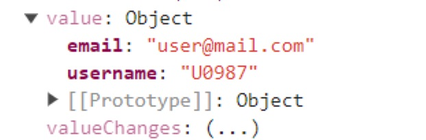
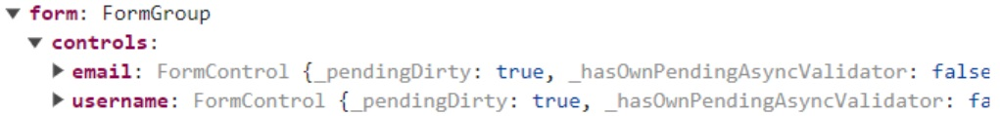
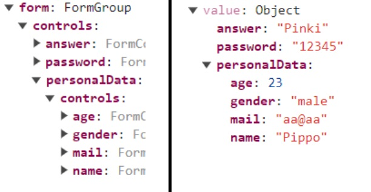
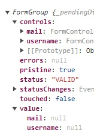
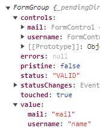

# Angular Forms

Angular helps you to handling forms.

To handle forms Angular uses two approaches:

- [Template Driven (TD)](#template-driven-td-forms)
- [Reactive](#reactive-forms)

## Template Driven (TD) forms

Angular infers the Form Object from the DOM.

Let's see with this approach how to:

1. [create basic form](#td---basic-form)
2. [submit form](#td---submit-form)
3. [apply ng ref to the form](#td---use-ng-ref-in-the-form-tag)
4. [apply ng reference to the forms' controls](#td---use-ng-ref-and-ngmodel-in-the-form-controls-tag)
5. [use forms validators](#td---forms-validators)
6. [use form states](#td---form-states)
7. [add validation error message](#td---validation-errors)
8. [use grouping form controls](#td---grouping-form-controls)
9. [use data binding with ngmodel](#td---data-binding-using-ngmodel)
10. [edit and/or reset form](#td---edit-and-reset-form)
11. [consuming data form](#td---consuming-data-from-the-form)

### TD - Basic form

When you can create a basic form in Angular like below:

```
<form>
  <label>Username</label>
  <input type="text"/>
  <label>Mail</label>
  <input type="email"/>
  <button type="submit">Save</button>
</form>
```

and you inspect the HTML element with dev tool you'll see:

```
<form novalidate class="ng-untouched ng-pristine ng-valid">
  <label>Username</label>
  <input type="text">
  <label>Mail</label>
  <input type="email">
  <button type="submit">Save</button>
</form>
```

It means that Angular by default adds classes representative of the `form states` that will be analyzed later in the [states section](#td---form-states).

### TD - Submit form

In HTML/CSS form, the submission is defined in the open tag form, defining `method` and `action` attributes, that usually use php script.

In Angular form can be used the angular event `(ngSubmit)`, like below, to handle the form submission:

```
<form (ngSubmit)="onSubmit()">
  <label>Username</label>
  <input type="text"/>
  <label>Mail</label>
  <input type="email"/>
  <button type="submit">Save</button>
</form>
```

when users will push on the submit button, the onSubmit() method will be triggered.

### TD - Use ng ref in the form tag

To refer to the HTML element, you can use the ng references, assigning one to the form, e.g. #ngForm:

```
<form #myForm (ngSubmit)="onSubmit(myForm)">
  <label>Username</label>
  <input type="text"/>
  <label>Mail</label>
  <input type="email"/>
  <button type="submit">Save</button>
</form>
```

In this case if you pass `myForm` to the onSubmit() method to log in console the ref:

```
onSubmit(form: any) {
  console.log(form);
}
```

The console will log the HTML element, so the you can use both type `any` or `HTMLElement`.

To get from Angular an object from the HTML template, in the form tag you need to make a small change, that is replace `#myForm` with `#myForm="ngForm"`:

```
<form #myForm="ngForm" (ngSubmit)="onSubmit(myForm)">
  <label>Username</label>
  <input type="text"/>
  <label>Mail</label>
  <input type="email"/>
  <button type="submit">Save</button>
</form>
```

There are two ways to access the ng template content:

1. passing the ng ref in the method `OnSubmit(myForm)`
2. accessing the ngform using the @ViewChild and using the value inside the method `onSubmit()` without any argument

   ```
   @ViewChild('myForm') form!: NgForm;

   onSubmit() {
     console.log(this.form);
   }
   ```

The onSubmit() method in both cases will log in the console an object of type `ngForm` as below:


You can easily note that this object contains a lot of info regarding the form, like e.g.`enabled`, `valid`, `touched`, etc.

If you expand the property `value`, you still cannot see the values coming from the forms control, but you see just a generic object.

### TD - Use ng ref and ngModel in the form controls tag

In order to pass the pairs key/value of the controls inside the property `value`, you need to set the `name` attribute to the key and the value of the name property to the value.

In this way in the big `ngForm` object, under the `value` property, you'll have the mapped pairs:

and under the `controls` property:


**Please note** Each single control will have a structure like the main ngForm with properties like e.g.`enabled`, `valid`, `touched`, etc.

### TD - Forms validators

Now that the form and its controls are correctly parsed to ngForm model, you can apply validation to one or more form controls, then will result in a validator for the whole form.

Using Angular form, it is possible to apply two different type of validators:

1. CSS validators, like e.g. `required`
2. Angular validators, that are directives that will be applied to the HTML element, liek e.g. `email`, that check if the value is following the rules for a standard email address.

You can find more regarding validators on [CSS validators](https://www.the-art-of-web.com/html/html5-form-validation/) and [Angular Directives validators](https://angular.io/api?query=validator&type=directive) searching for `validators`.

**Please note** By default Angular disables HTML5 validation adding `novalidate` attribute, but you can re-enable it by adding the `ngNativeValidate` to a control in your template.

Let's add some validators inthe HTML template:

```
    <form #myForm="ngForm" (ngSubmit)="onSubmit()">
      <label>Username</label>
      <input type="text" ngModel name="username" required />
      <label>Mail</label>
      <input type="email" ngModel name="email" email />
      <button type="submit">Save</button>
    </form>
```

If you now submit the form with missed username or with invalid email, you can check that the object ngform will have:

```
status: "INVALID"
valid: false
```

Let's assume you did not provide any value:

- `email` will be considered `valid` as it was not required
- `username` will be considered `invalid` as it was required

In this case under `form >> controls >> email` you'll have:

```
status: "VALID"
valid: true
```

but under `form >> controls >> username` and `form`

```
status: "INVALID"
valid: false
```

From the above example you can understand how Angualr handle validation form, using Template Driven approach.

### TD - Form states

The values contained inside the `ngForm` object like e.g.:

- dirty / pristine
- disabled / enabled
- invalid / valid
- touched / untouched

are called `form states`.

To understand their current states, you can access the ngForm object or exploit the classes added automatically by Angular to the each form control and to the form itself.

As already showed in the section relative to the [basic-form](#td---basic-form), Angular by default add classes to the HTML element:

- `ng-untouched` => same as ngForm properties `untouched=true` and `touched=false`, it means that the form or the control was not even touched
- `ng-touched` => same as ngForm properties `touched=true` and `untouched=false`, it means that the form or the control was touched
- `ng-pristine` => same as ngForm properties `pristine=true` and `dirty=false`, it means that the form or the control was never filled in
- `ng-dirty` => same as ngForm properties `dirty=true` and `pristine=false`, it means that the form or the control was filled in with values
- `ng-valid` => same as ngForm properties `valid=true`, `invalid=false`, `status="VALID"`, it means that the form or the control was successfully validated based on the applied validators
- `ng-invalid` => same as ngForm properties `invalid=true`, `valid=false`, `status="INVALID"`, it means that the form or the control was not successfully validated based on the applied validators

Thanks to this automatically added/updated real time classes, you can set css style based on the form or control states.

You can also disabled the submit button using the valid state of the form:

```
<button type="submit" [disabled]="!myForm.valid">Save</button>
```

### TD - Validation errors

You can display customized validation error if a validation invalid:

```
<input type="text" ngModel name="username" required #username="ngModel" />
<p *ngIf="username.invalid && username.touched">
  You must insert an username!
</p>
```

to have access to the control info, you should use ng template of type ngModel:
`#username="ngModel"`
and then you can check if it is invalid `username.invalid`

### TD - Grouping form controls

You can group multiple controls inside a group control using the `ngModelGroup="groupName"` and you can access the group properties using
`userData="ngModelGroup"`

It will group controls inside the `form>>controls` and inside the `form>>value`



### TD - Data binding using ngModel

You can use `ngModel` also for data binding:

- one way binding to set, e.g. default value for a control
- two way binding to display answer realtime

in te HTML template:

```
<input name="name" [ngModel]="defaultUser" required>
<textarea name="answer" cols="30" rows="2" [(ngModel)]="secretAnswer">
</textarea>
<p>Your answer is {{secretAnswer}}</p>
```

in the TS file:

```
  defaultUser = 'Pippo';
  secretAnswer = '';
```

### TD - Edit and Reset form

It is possible to edit form values using typescript. You can:

- overwrite all the values (not recommended if you want to edit just few) using `setValue`:
  ```
    this.appForm.setValue({
      answer: '',
      password: '',
      personalData: {
        name: '',
        gender: '',
        age: 0,
        mail: this.defaultEmail,
      },
      secret: '',
    });
  ```
- patch the required values (recommended) using `form.patchValue`:
  ```
  this.appForm.form.patchValue(
    {
      personalData: {
        mail: this.defaultEmail
        }
    }
  );
  ```
  To `reset values` of the form of a single control, you can use the `reset()`:

```
this.appForm.reset()
```

### TD - Consuming data from the form

You can use the values coming from the form in TypeScript `this.appForm.value` in the TS file:

```
  details = {
    answer: '',
    password: '',
    personalData: {
      name: '',
      gender: '',
      age: 0,
      mail: '',
    },
    secret: '',
  };
this.details.password = this.appForm.value.password;
this.details.secret = this.appForm.value.secret;
this.details.answer = this.appForm.value.answer;
this.details.personalData.name = this.appForm.value.personalData.name;
this.details.personalData.gender = this.appForm.value.personalData.gender;
this.details.personalData.age = this.appForm.value.personalData.age;
this.details.personalData.mail = this.appForm.value.personalData.mail;
```

and then use the details variable in the HTML template.

## Reactive forms

Form is created programmatically and synchronized with the DOM.

Let's see with this approach how to:

1. [create basic form in ts code](#ts---create-basic-form-in-code)
2. [submit form in ts code](#ts---submit-forms)
3. [sync HTML and TS form](#ts---how-to-sync-html-and-ts-form)
4. [sync controls and group them](#ts---grouping-controls)
5. [arrays of controls](#ts---array-of-controls)
6. [set default values and use build-in validators](#ts---default-values-and-build-in-validators)
7. [create custom validators](#ts---create-custom-validators)
8. [validate error message](#ts---how-to-validate-error-message)
9. [create custom async validators](#ts---create-custom-async-validators)
10. [edit and/or reset form](#ts---edit-and-reset-form)
11. [react to status or value changes](#ts---react-to-status-or-value-changes)

### TS - Create basic form in code

It is possible to create the form template directly using the code, usually it is done in the ngOnInit() when the component is initialized.

First you create a variable that will hold the form, e.g. `myForm`, that will be of type `FormGroup`:

```
myForm:!FormGroup
```

Now you can initialize the variable `myForm`. Each controls will be of type `FormControl`:

```
this.myForm = new FormGroup({
      username: new FormControl(),
      'mail': new FormControl()
      });
```

### TS - Submit forms

In HTML/CSS form, the submission is defined in the open tag form, defining `method` and `action` attributes, that usually use php script.

In Angular form can be used the angular event `(ngSubmit)`, like below, to handle the form submission:

```
<form (ngSubmit)="onSubmit()">
  <label>Username</label>
  <input type="text"/>
  <label>Mail</label>
  <input type="email"/>
  <button type="submit">Save</button>
</form>
```

when users will push on the submit button, the onSubmit() method will be triggered.

### TS - How to sync HTML and TS form

In order to sync HTML and TS form you need to use the directive `[formGroup]`:

```
<form [formGroup]="myForm">
  ...
</form>
```

**Please note** that to be able to use the above directive you need to add `ReactiveFormsModule` in `app.module` under `imports:[]` or you'll get following error: `Can't bind to 'formGroup' since it isn't a known property of 'form'.`

If you log in the console the variable `myForm`, you will see an object of type FormGroup and under the `controls` property:



Here Angular recognizes that the form has two controls, with name as in the TS form, but their are disconnected from the actual controls, in fact even if you assign a value in the form to any control, the console will always shows value `null`.

Let see in the next section how to connect also the control.

### TS - How to sync controls and group them

In order to sync HTML and TS form you need to use the directive `[formControlName]`:

```
<form [formGroup]="myForm" (ngSubmit)="onSubmit()">
  <label>Username</label>
  <input type="text" [formControlName]= "'username'" />
  <label>Mail</label>
  <input type="email" formControlName = "mail" />
  <button type="submit">Save</button>
</form>
```

In this way Angular will be able to detect the controls value:

.

In case you want to group the controls in groups, in ts we use `FormGroup()`

```
this.myForm = new FormGroup({
      personalData: new FormGroup({
        name: new FormControl(),
        gender: new FormControl(),
        age: new FormControl(),
      }),
      mail: new FormControl()})
```

and in the HTML you need to group all these controls inside a container, e.g. a div and use in that div the directive `formGroupName` like:

```
<div formGroupName="personalData">
```

### TS - Array of controls

Sometimes you need to give possibility to add an array of values, e.g. list of certifications.

In order to allow user to insert one or more value, you need to use the `formArray`, that are array of controls.

```
    this.myForm = new FormGroup({
      mail: new FormControl(),
      languages: new FormArray([]),
    });

onAddLanguages() {
  const control = new FormControl(null, Validators.required);
  if (this.myForm.controls['languages'].valid) {
    (<FormArray>this.myForm.get('languages')).push(control);
  }
}
```

In order to get an array from the get controls of the form `myForm.get('languages')`, you need to cast to `<FormArray>`.

Same if you want to pass it inside the HTML template, first you need to put inside the method `ngOnInit` the cast to map to a new variable:

```
  languages!: FormArray;

  ngOnInit(): void {
    this.myForm = new FormGroup({
      mail: new FormControl(),
      languages: new FormArray([]),
    });
    this.languages = <FormArray>this.myForm.get('languages');
  }
```

To sync the HTML with the TS file you need to use the `formArrayName` directive:

```
<div formArrayName="languages">
```

### TS - Default values and build-in validators

When you define a control in TS code, for a form, you can create a new object without providing any argument, or you can add arguments:

- first argument is the default value of the control
- single validator or array of validators
- single of array of async validators, you'll see in the capter about [custom async validators](#ts---create-custom-async-validators)

Examples with use of `build-in validators`:

```
pswRgx = '[A-Z]+[a-z]+[0-9]{2,}[!@#$%^&*]+';
ngOnInit(): void {
  this.myForm = new FormGroup({
    name: new FormControl(null, Validators.required),
    age: new FormControl(null,[Validators.min(18),Validators.max(90)]),
    mail: new FormControl(null, [Validators.required, Validators.email]),
    gender: new FormControl('male'),
    password: new FormControl(null, [
            Validators.pattern(this.pswRgx),
            Validators.minLength(10),
            Validators.maxLength(12),
          ])
  });
}
```

Above you can see:

- how to set default value, e.g. the control `gender` to `'male'`:
  `gender: new FormControl('male')`
- use of some build-in validators:
  - `Validators.required`
  - `Validators.min(18)`
  - `Validators.max(90)`
  - `Validators.email`
  - `Validators.pattern(this.pswRgx)`
  - `Validators.minLength(10)`
  - `Validators.maxLength(12)`

It is possible also to create custom validators.

### TS - Create custom validators

Could be possible that, in your form, you want to check if the email has one of the allowed domains, or name is one of the not allowed values.

You can create a function like below:

```
names(control: FormControl): { [s: string]: boolean } | null {
  if (this.forbiddenNames.indexOf(control.value) !== -1) {
    return { nameForbidden: true };
  }
  return null;
}
```

The custom validators must accept at least one argument, the `control: FormControl` and must return a `ValidationErrors` object `{ [s: string]: boolean }` or `null`.

In order to use it, you need to add the method in the array of the validators:

```
name: new FormControl(null, [
          Validators.required,
          this.names.bind(this),
        ])

```

**Please note** that if you refer to a property of the component in the custom validator, you need to add `.bind(this)` to say to Angular to check this component when evaluate the control in the form. If you do not use the `bind` method, you'll get the error ` Cannot read properties of undefined`

### TS - How to validate error message

Also using TS template, you can use `states` to apply a style when a control is invalid.

```
input.ng-touched.ng-invalid {
  outline: red solid 2px;
}
```

You can create a message, accessing the `control state` in the HTML:

```
<p *ngIf="myForm.get('personalData')?.get('name')?.touched &&
          myForm.get('personalData')?.get('name')?.invalid">
  You must enter a valid name!
</p>
```

In this case the name control has 2 validators:

```
name: new FormControl(null, [
          Validators.required,
          this.names.bind(this),
        ]),
```

but the error message is only on generic.

You can give better details to the user if you know the exact error that validation returns.

Here become useful the `error codes` that appear under the specific controller inside `errors`

```
<p *ngIf="myForm.get('personalData')?.get('name')?.touched &&
          myForm.get('personalData')?.get('name')?.invalid">
  <span *ngIf="myForm.get('personalData')?.get('name')?.hasError('required')">
    Name cannot be empty!
  </span>
  <span *ngIf="myForm.get('personalData')?.get('name')?.hasError('nameForbidden')">
    You must enter a valid name!
  </span>
</p>
```

Here we have a customized error message based on the actual error validation; to call it you have to call the controller (`myForm.get('personalData')?.get('name')`) and use the `hasError()` method with argument the error name.

### TS - Create custom async validators

Sometimes the validation could need to wait for some data coming from external source, e.g. database or answer got by HTTP call, in this case, you need an async validators.

Let's create them using Observable or Promise:

```
  asyncForbiddenMailsObs(): AsyncValidatorFn {
    return (control: AbstractControl): Observable<ValidationErrors | null> => {
      return timer(1000).pipe(
        map(() => {
          return control.value === 'test@yahoo.com'
            ? { mailForbidden: true }
            : null;
        })
      );
    };
  }
```

```
  asyncForbiddenMailsPrm(): AsyncValidatorFn {
    return (control: AbstractControl): Promise<ValidationErrors | null> => {
      return new Promise<any>((resolve, reject) => {
        setTimeout(() => {
          if (control.value === 'test@gmail.com') {
            resolve({ mailForbidden: true });
          } else {
            resolve(null);
          }
        }, 1000);
      });
    };
  }
```

and use it inside the control.

```
mail: new FormControl(
  null,
  [Validators.required, Validators.email, this.domains.bind(this)],
  [this.asyncForbiddenMailsPrm(), this.asyncForbiddenMailsObs()]
),
```

In these two functions you have a delay of 1 sec before the validation is checked.
For async validators you do not need to use the `bind(this)` to consume a variable defined in the same component.

If you inspect the DOM, after updating the mail, you can see that the class `ng-valid` or `ng-invalid` change to `ng-pending` and keep that status until the validation is done, to switch back to one of the `ng-valid` or `ng-invalid`.

### TS - Edit and reset form

As in the Template driven approach you can do it using methods:

- setValue()
- patchValue()
- reset()

Check details in chapter [TD - Edit and reset form](#td---edit-and-reset-form).

### TS - React to status or value changes

If it is possible to track the value changes or the status changes.

```
this.myForm.valueChanges.subscribe((value) => {
  console.log('value changed!');
  console.log(value);
});

this.myForm.statusChanges.subscribe((status) => {
  console.log('current status of the form is: ' + status);
});
```

In this way you are informed, real time, of any change happening in your form.
