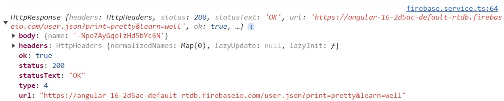

# HTTP

Angular and other front end frameworks, e.g. React,Vue etc., when need to store data, don't connect directly with databases.

Let's see the data flow in the following picture:


1. when `Angular` needs to store, update or retrieve data to or from a storage, it makes an HTTP request to the back end application, using APIs, and the `HTTP module`
2. back end services, written using e.g. Node.js, Java, Phyton or any other technologies, provide `APIs` with endpoints, e.g. `https://.../service/client/01`
3. `HTTP requests` uses `HTTP verbs` to define which kind of operation you want to perform, e.g. `GET`, `POST`, etc.
4. based on the `HTTP requests` and `HTTP verbs` the back end service connect with the database and perform a `CRUD` operation

Let's see all of these in the details:

1. [HTTP verbs](#http-verbs)
2. [What is an API](#what-is-an-api)
3. [HTTP requests and responses](#http-requests-and-responses)
4. [How to make HTTP requests](#how-to-make-http-requests)
5. [HTTP request sync issue with ngOnInit](#http-request-sync-issue-with-ngOnInit)
6. [How to manipulate the response body](#how-to-manipulate-the-response-body)
7. [HTTP response types](#http-response-types)
8. [HTTP error handling](#http-error-handling)
9. [HTTP request properties](#http-request-properties)
10. [HTTP interceptors](#http-interceptors)

## HTTP verbs

There are 6 basic request patterns which apply to most endpoints (APIs), and these are based on HTTP verbs.

The basic request patterns are:

- retrieve single item or list of items - `GET`
- create a new item - `POST`
- update an item - `PATCH` or `PUT`
- delete an item - `DELETE`

## What is an API

Application programming interfaces, known as `APIs`, are set of rules that two systems, one as publisher, `server side` and other as consumer, `client side`.

These rules are included in endpoints that receive `HTTP requests` and return `HTTP response`.

## HTTP requests and responses

To make a valid request, the client needs to include some things:

1. `URL` (Uniform Resource Locator) e.g. `https://.../service/client/01`
2. `HTTP method` (or verb)
   - `POST` to create a new record
   - `PUT` to update an existing record
   - `PATCH` to update only a part of an existing record
   - `GET` to retrieve one or more records
   - `DELETE` to delete a record
3. `headers`, that contain metadata in key-value pairs, needed to process the request
4. `body` (or `payload`) contains the data the client wants to send to the server, so it is not used with `GET` or `DELETE`
5. optional `query parameters`, defined set of parameters in key-values pair,attached to the end of the URL, used to provide additional information, e.g. `https://.../service/clients?gender=male`

## How to make HTTP requests

In order to make requests, we have two requirements:

1. to have a valid API to use
2. to add `HttpClientModule` in app.module inside the imports array.
3. import the HttpClientModule `import { HttpClientModule } from '@angular/common/http';`

In this case as API will be used Firebase.

## HTTP request sync issue with ngOnInit

Sometimes could be required to load data, with the response of an HTTP request, to assign it to a variable that has a default initial value.

If, in the ngOnInit method, you set the value of a variable equal to the result of an HTTP request, there will be a delay on the new value assignment, equal to the time needed to get answer from the called server.
It means that in the while, the variable will keep the initial value, e.g. having in the code side:

```
customers: LocalUser[] = [];
ngOnInit(): void {
   this.httpService.retrieveCustomers().subscribe((response) => {
   this.customers = response;
   });
}
```

and in the template side:

```
<tr *ngFor="let item of customers" (click)="editUser(item)">
<td>{{item.name}}</td>
<td>{{item.mail}}</td>
<td>{{item.age}}</td>
</tr>
```

In this case, if the HHTP request get an answer from the server after one second, when you load the page the first time, for a second the variable `customers` will be still empty, and the table as well.

To avoid Angular routing displaying, even for a while, incorrect data, you can use a [resolver](./routing.md/#resolvers) to make the HTTP call before even initialize the component.

To do it you have to:

1. create a `resolver`, in this case has been created [HttpResolver](../app/http/http.resolver.ts)
   ```
   export const HttpResolver: ResolveFn<LocalUser[]> = (_route, _state) => {
      return inject(FirebaseService).retrieveCustomers();
   };
   ```
2. assign it to routing path of the component, in the [app-routing.module](../app/app-routing.module.ts), with a key, in this case `customers`
   ```
   {
    path: 'http',
    component: ManageUsersComponent,
    resolve: { customers: HttpResolver },
   },
   ```
3. consume it in the component:
   ```
   ngOnInit(): void {
      this.route.data.subscribe(
      (data: Data) => (this.customers = data['customers'])
      );
   }
   ```

Using the resolver, if you reload the page, since the beginning, the variable `customers` will have the real value coming from the server and then also the table will not start with the initial value.

## How to manipulate the response body

Often the HTTP response is an a format that it is not compatible with the object defined in TypeScript. In this case you need to map the response to match your needs.

To do it, before subscribe the observable obtained from the HTTP request, you need to use the `pipe()` method accept as argument one of the `rjxs operators`.

These operators are used for different reason:

- `creation operators` - e.g. interval,timer, range
- `join creation operators` - e.g. zip, concat
- `transformation operators`- e.g. map, concatMap
- `filtering operators` - e.g. filter,first,take
- `join operators` - e.g. concatAll, startWith
- `multicasting operators` - e.g. publish
- `error handling operators` - e.g. catch, retry
- `utility operators` - e.g. tap, timeout
- `conditional and boolean operators` - e.g. find, findIndex
- `mathematical and aggregate operators` - e.g. max, min, count, reduce

More details regarding these operators can be found at [rxjs.dev](https://rxjs.dev/guide/operators).

**please remeber** that is recommended to extract the methods that make the Http request in a deidcated service, like e.g. `FirebaseService`, and make all the data transformation there. In the component you should just handle the values after subscription, just as you had data already hardcoded in the component.

In the `FirebaseService` when making a request to the service to get all the customers, you receive a response like:

```
{
    "-NpBxH_trzrP8CBxmnFo": {
        "age": 40,
        "mail": "lionel@messi.argentina",
        "name": "Messi"
    },
    "-Npj0xzJE4PTSS_V4vr3": {
        "age": 55,
        "mail": "user@gmail.com",
        "name": "Pippo"
    }
}
```

that means you get from the server an answer of type:

```
{ [key:string]: {
   age:number  | null | undefined,
   mail:string | null | undefined,
   name:string | null | undefined,
   }
}
```

and have to transform it into an Array of `LocalUser` that is of type:

```
{
   remoteId?: string,
   name: string | null,
   mail: string | null,
   age: number | null,
}
```

Example of data transformation is done in the `retrieveCustomers()` method:

```
retrieveCustomers() {
   return this.getAll().pipe(
      map((users) => {
         const people: LocalUser[] = [];
         for (const key in users) {
            people.push(<LocalUser>{
            remoteId: key,
            ...users[key],
            });
         }
         return people;
      })
   );
}
```

## HTTP response types

Sometimes data transformations with the use of the `rxjs operators` can be hard, in these cases, declaring `response type` instead of the generic `any` could help simplying these operations.

Let's see e.g. the put() method with and without use of the `response type`

```
putWithoutType(body: HttpUser, id: string) {
   return this.httpClient.put(`${this.url}user/${id}.json`, body)
   .pipe( tap( (answer) => {
            console.log('update customer with name: ' +
            (<HttpUser>answer).name);
         })
   );
}
```

```
put(body: HttpUser, id: string) {
   return this.httpClient.put<HttpUser>(`${this.url}user/${id}.json`, body)
   .pipe( tap( (answer) => {
            console.log('update customer with name: ' + answer.name);
            })
   );
}
```

## HTTP error handling

All the previous response analysis, are based on the assumptions that there is no problem on the server side.

Sometimes happens that server return an error.

HTTP errors could be of different type, the most common can be grouped in two main categories:

- `4xx (400-499)` - `client error response` - means that it happens because of some error in how you send the request to the server
- `5xx (500-599)` - `server error response` - means that there is a problem on the server side

Most common 4xx errors are:

- `400 Bad Request` - something bad in the body
- `401 Unauthorized` - customer is not authenticated
- `403 Forbidden` - customer is authenticated but has not the required accesses
- `404 Not Found`- record not found in the database
- `405 Method Not Allowed` - HTTP method not allowed for the API, e.g. sometime API doesn't allow the DELETE method
- `415 Unsupported Media Type` - body is in a not supported Media type, e.g. you send a xml when the accepted Media Type is Json.

Most common 5xx errors are:

- `500 Internal Server Error` - on server side an unexpected error was thrown
- `502 Bad Gateway` - the server received an invalid response from the upstream server.
- `503 Service Unavailable` - server is not ready to handle the request or is down

The server could throw an HHTP error, so you need to be ready to handle this error.

Let's see how to handle error:

- [in the resolver before submitting](#catcherror-operator)
- [pass error to next layer for handling](#throwerror-operator-and-subject)
- [directly in the component after submitting](#subscribe-error-property)

### CatchError operator

If you are using a resolver, as in the case of the `HttpResolver`, you have to handle the error in two place:

1. in the resolver in the `pipe`
2. in the component using `subscribe next`

In the resolver in the pipe you can use two `rjxs operators`, the `map operator` for positive path and the `catchError operator` to handle the error.

```
.pipe(
   map((result) => result),
   catchError((error) => {
      return of({ error: error });
   })
);
```

in this case you can pass the error to the component as object with parameter error.

The final part of the error handling in this case will be done in the subscription in the `next` property:

```
this.route.data.subscribe({
   next: (data: Data | any) => {
      let response = data['customers'];
      if (response.error) {
         this.error = <HttpErrorResponse>response.error;
      } else {
         this.customers = response;
      }
   },
});
```

### ThrowError operator and Subject

In case you want to pass the error to the next level, you can use the `throwError operator`:

```
catchError((catError) => {
          console.log('error caught')
          return throwError(() => catError);
        })
```

Of course the above code is not a proper error handling, but it is useful to understand how to pass error to next layer, after doing something, in this case after logging something.

In the component you can handle it in the subscription in the error property:

```
error = new Subject<HttpErrorResponse>();
error: (webError) => {
        console.log(webError);
        this.error.next(webError);
      },
```

Here above you save the error in a `Subject` that is an observable, in case this error needs to be shared with other methods:

```
errorMessage = '';
ngOnInit(): void {
   ...
   this.error.subscribe((error) => {
      console.log(error.message);
      this.errorMessage = error.message;
   });
}
```

### Subscribe 'error' property

If in the component you are making the HTTP request directly or you call directly the service that does it, the error handling needs to be done during the subscription, in the `error` property:

```
updateList() {
    this.httpService.retrieveCustomers().subscribe({
      next: (response) => {
        this.customers = response;
      },
      error: (error) => {
        this.error = <HttpErrorResponse>error;
        console.log('trying handle error data');
      },
    });
  }
```

## HTTP request properties

Until now, when has been used the `HttpClient` in this session, it has been used with two arguments:

1. `url`:string
2. `body`: any | null

but any type of HttpRequest has a third optional argument called `options`. It is an object with several properties, all optional:

1. [headers](#headers)
2. [context](#context)
3. [observe](#observe)
4. [params](#params)
5. `reportProgress`
6. [responseType](#responsetype)
7. `withCredentials`

These options allows you to customize your Http requests and responses.

More details can be found in [Angular HttpClient](https://angular.io/api/common/http/HttpClient#http-request-example).

### Headers

The headers contain metadata in key-value pairs, needed to process the request.

```
headers?: HttpHeaders | {
[header: string]: string | string[];
};
```

Some examples of the most common ones are:

- `Accept`, defines the media-type that the client is able to accept from the server, e.g. `Accept: application/json`
- `Authorization`, is used to send credentials or token when required
- `Content-Type` defines the media-type of the payload in the `request headers`, and media-type of the response in the `response headers`, e.g. `Content-Type: application/json`

To add default or custom headers, you need to create an `HttpHeaders` object and define it in the `optional` object:

```
let newHeader = new HttpHeaders()
newHeader.append('new-header', 'newest')
let myHeaders = new HttpHeaders({
   'Custom-Header': 'Hello',
   'Content-Type': 'application/json',
   });
myHeaders = myHeaders.append('new-header', 'newest');

...
return this.httpClient
.post(
   url,
   body,
   {
   headers: myHeaders
   },
)
```

**please be aware** that in the above case, the variable `newHeaders` will be empty as the `.append()` and `.set()` methods create a clone of the HttpHeaders and add to it the new header. So it is required to overwrite the value as in `myHeaders = myHeaders.append('new-header', 'newest');` every time you add a new header to the `HttpHeaders`

### Context

`Http context` stores arbitrary user defined values and ensures type safety without actually knowing the types.

One example is:

```
const IS_CACHE_ENABLED = new HttpContextToken<boolean>(() => false);
const myContext = new HttpContext().set(IS_CACHE_ENABLED, true);
...
return this.httpClient
.post(
   url,
   body,
   {
   context: myContext
   },
)
```

### Observe

The HTTP requests return an observable that needs to be subscribed in order to emit the value.

The `observe` property allow you to decide what to observe, in other words, which kind of response you want.

There are possible values you can observe:

1. `body` - default value - returns the `response from the server`; the type of this response is based on the contract of the used API, e.g. making POST request to Firebase:
   ```
   {name: "-Npo7AqRIhuwkNRm0NEM"}
   ```
2. `response` - returns more informations, in an object of type `HttpResponse`, that contains in the property called `body` the value of previous point. Together with the body there are other values:

- `body` - `body?: T | null` is the response coming from the specific API, based on the contract of the used API
- `headers` - `headers?: HttpHeaders` contains all the response headers
- `ok` - `ok: boolean` checks whether the status code falls in the 2xx range.
- `status` - `status?: number` is the response status code
- `statusText` - `statusText?: string` is the textual description of response status code, defaults to OK
- `type` - `HttpEventType.Response` is the event type number that for the response is always 4.
- `url` - `url?: string` - ia the URL of the resource retrieved, or null if not available.



3. `events` - returns the steps of your HTTP request as described in the enum:

- `0` - `Sent` - The request was sent out over the wire
- `1` - `UploadProgress` - An upload progress event was received
- `2` - `ResponseHeader` - The response status code and headers were received
- `3` - `DownloadProgress` - A download progress event was received
- `4` - `Response` - The full response including the body was received
- `5` - `User` - A custom event from an interceptor or a backend

The events 0 and 4 are returned when making a post.

The event 1 and 3 are returned when you upload / download files.

### Params

The params property is used to add query parameters.

To add one or more parameters you can do as below:

```
let myParams = new HttpParams()
myParams = myParams.set('print', 'pretty');
myParams = myParams.append('learn', 'well');
...
return this.httpClient
.post(
   url,
   body,
   {
   params: myParams
   },
)
```

**please be aware** the `.append()` and `.set()` methods create a clone of the HttpParams, and add to it the new params. So it is required to overwrite the value as in `myParams = myParams.append('learn', 'well');` every time you add a new query param to the `HttpParams`

### ResponseType

The `response type` indicates the `expected MediaType`, the format in which will be returned the response:

```
responseType?: 'arraybuffer' | 'blob' | 'json' | 'text';
```

As from the above definition, the response type can assume four possile values:

1. `arraybuffer` -array of bytes, usually for file update/download
2. `blob` - it is used for `Binary Large Object`, to store the contents of each file in a repository
3. `json` - is the default value and defauld standard of the HTTP request/response
4. `text` - plain text, unformatted text

## HTTP interceptors

The `interceptors` are services that intercept the HTTP requests and allow to change the requests or the responses.

In order to create automatically a basic interceptor using the terminal, you can use:
`ng generate interceptor auth` or `ng g interceptor auth`

it will generate two files:

- auth.interceptor.ts
- auth.interceptor.spec.ts

If you are not interested in tests, you can add at the end of the command:
`--skip-tests=true`

**please note** that in this case you cannot use the shorter command `ng g i auth` because it will generate one file, an interface auth.ts and not an interceptor

```
export interface Auth {}
```

The basic structure of an interceptor is:

```
@Injectable()
export class AuthInterceptor implements HttpInterceptor {
  constructor() {}

  intercept(
    request: HttpRequest<unknown>,
    next: HttpHandler
  ): Observable<HttpEvent<unknown>> {
    return next.handle(request);
  }
}
```

The interceptor is a service that has to implement the `HttpInterceptor`, and the `intercept` method that accepts two arguments:

- `request:HttpRequest<unknown>`
- `next: HttpHandler`
  and return:
- `next.handle(request)`

**N.B.** To edit the request, you need to clone it, edit it and return the cloned one, the direct edition is not allowed.

One of the most common reasons to use interceptors, is to add auth headers to the calls made by the application, but you can do a lot more.

`Changes to the request` can be done inside the `intercept function`:

```
intercept(
   request: HttpRequest<unknown>,
   next: HttpHandler): Observable<HttpEvent<unknown>>  {
   request = request.clone({
      url: request.url.concat('.json'),
      headers: request.headers.append('Auth', 'xyz'),
      });
   return next.handle(request);
   }
```

In this case you edit the `url` and the `headers`.

`Changes to the response` can be done after the handle method, using the pipe method.

```
intercept(
    request: HttpRequest<unknown>,
    next: HttpHandler): Observable<HttpEvent<unknown>> {
    return next.handle(request).pipe(
      tap((event) => {
        if (event.type === HttpEventType.Response) {
          console.log('body');
          console.log(event.body);
        }
      })
    );
  }
```

From the previous example you can notice that the interceptor returns `HttpEvent`, and you are doing something only in case the type is `response`

Created services that implement `HttpInterceptor`is not enough to have working interceptors. Like the services, to trigger them you need to defined them in `AppModule` inside the `providers`

```
providers: [
   MainService,
   {
   provide: HTTP_INTERCEPTORS,
   useClass: AuthInterceptor,
   multi: true,
   },
   {
   provide: HTTP_INTERCEPTORS,
   useClass: ResponseInterceptor,
   multi: true,
   },
],
```

The difference with normal service is that:

- to initialize and use any service it is enough to put its name inside the providers array (e.g. `MainService`)
- to initialize and use interceptors, you need to add inside the providers an object with three parameters:
  1.  `provide: HTTP_INTERCEPTORS` same value for each interceptor
  2.  `useClass` has as value the name of the interceptor
  3.  `multi` usually set to true to allow use of multiple interceptors

When you want to use more than one interceptor, it is enough to add another object with the three parameters defined as above.

**Please note** that the interceptors will be executed from top to the bottom in the providers array, so the order in which you write them inside the providers is important as in some case could change the final result.
